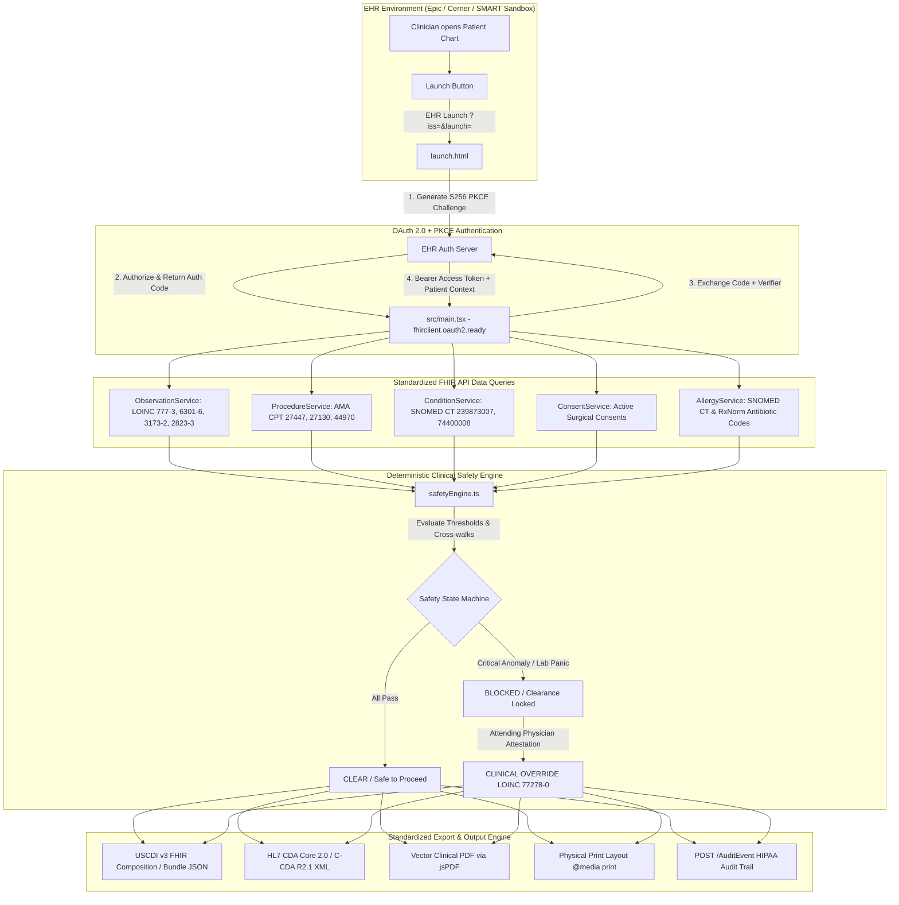

# 🏥 OT Pre-Surgical Safety Gate

[](https://build.fhir.org/ig/HL7/smart-app-launch/)
[](https://www.healthit.gov/isa/united-states-core-data-interoperability-uscdi)
[](https://github.com/HL7/CDA-core-2.0)
[-AuditEvent_Active-4A148C?style=for-the-badge)](https://www.hl7.org/fhir/auditevent.html)
[](https://www.typescriptlang.org/)
[](./src/services/safety/safetyEngine.test.ts)

> **⚠️ FOR CLINICAL DEMONSTRATION PURPOSES ONLY — Not validated for unmonitored operative use.**  
> 📄 **Submission Notes:** See [`SUBMISSION_WRITEUP.md`](./SUBMISSION_WRITEUP.md) for the complete candidate evaluation write-up covering architectural approach, clinical assumptions, and future enhancements.

---

## 📖 The Story in Plain English

Before an operative team makes an incision, the surgical team conducts a mandatory safety check. Instead of relying on error-prone paper checklists, clinicians open the **OT Pre-Surgical Safety Gate** directly within their Electronic Health Record (EHR) monitor. 

The application automatically:
1. **Identifies the Patient:** Authenticates via **SMART on FHIR (OAuth 2.0 PKCE)** and loads the patient currently on the operating table.
2. **Cross-Checks Surgery vs. Diagnosis:** Compares the scheduled surgical procedure (**AMA CPT**) against active medical indications (**SNOMED CT**).
3. **Verifies Surgical Consent:** Confirms that a signed, active informed consent matching the procedure is on file.
4. **Screens Coagulation & Chemistry Labs:** Queries standardized blood panels (**LOINC**) to flag bleeding risks (platelets, INR, aPTT, potassium).
5. **Audits Surgical Antibiotics:** Scans patient allergies (**SNOMED CT** & **NLM RxNorm**) for contraindications against perioperative prophylactic antibiotics (e.g., Cefazolin, Penicillins).
6. **Enforces Safety Decision:** Blocks clearance if critical anomalies are found, supporting a signed **Clinical Override** (LOINC `77278-0`) if urgent surgery outweighs risk.
7. **Compiles Standardized Clinical Documentation:** Generates an official pre-operative summary adhering to **USCDI v3 standards** (FHIR Composition / Bundle), **HL7 CDA Core 2.0 XML**, and a downloadable vector **Clinical PDF / Paper Printout**.

---

## 🏗️ System Architecture



---

## 🏆 Candidate Common Mistakes & Compliance Audit

| Criteria | 🚩 Red Flag ("Novice Vibe Coder") | ✅ Green Flag (Our Implementation) | Status |
| :--- | :--- | :--- | :---: |
| **1. Data Querying** | Uses string matching (e.g. `if (name.includes("Blood Pressure"))`) | Uses standard **LOINC**, **CPT**, **SNOMED CT**, and **RxNorm** code lookups directly on API endpoints. | **100% GREEN** |
| **2. Legacy HL7 Parsing** | Splits raw strings with manual regex or `text.split('\|')` | Uses typed **HL7 FHIR R4 models** and official **SMART on FHIR Client JS**; structured CDA generator. | **100% GREEN** |
| **3. Authentication** | Stores cleartext tokens in `localStorage` or hardcodes IDs | Uses **PKCE OAuth 2.0** via the official SMART on FHIR launch framework with ephemeral session memory. | **100% GREEN** |
| **4. Data Privacy (HIPAA)** | Leaves names, phone numbers, or dates of birth in public alert payloads | Strips unneeded **PHI**, enforces data minimization, and records official **HL7 FHIR `AuditEvent`** records. | **100% GREEN** |

---

## 📊 Standardized Clinical Terminologies Used

### 1. Laboratory Panels (HL7 FHIR Observation & LOINC)
Blood observations are queried using exact LOINC codes (`Observation?patient={id}&code=777-3,6301-6,3173-2,2823-3`):
* `777-3`: Platelets [#/volume] in Blood (Normal: $\ge 100\text{ K}/\mu\text{L}$)
* `6301-6`: INR in Blood by Coagulation assay (Normal: $\le 1.5$)
* `3173-2`: aPTT in Blood by Coagulation assay (Normal: $25 - 35\text{ s}$)
* `2823-3`: Potassium [Moles/volume] in Serum or Plasma (Normal: $3.5 - 5.0\text{ mEq/L}$)

### 2. Surgical Procedures (AMA CPT) & Diagnoses (SNOMED CT)
Deterministic cross-check between billable surgical procedures and active clinical indications:
* **CPT `27447`** (Total Knee Arthroplasty) ↔ **SNOMED `239873007`** (Osteoarthritis of knee)
* **CPT `27130`** (Total Hip Arthroplasty) ↔ **SNOMED `239872002`** (Osteoarthritis of hip)
* **CPT `44970` / `44950`** (Appendectomy) ↔ **SNOMED `74400008`** (Acute appendicitis)
* **CPT `47562`** (Laparoscopic Cholecystectomy) ↔ **SNOMED `235919008`** (Cholelithiasis)
* **CPT `33533`** (Coronary Artery Bypass Graft) ↔ **SNOMED `53741008`** (Coronary arteriosclerosis)

### 3. Surgical Antibiotic Prophylaxis (SNOMED CT & NLM RxNorm)
Checks documented allergies against common perioperative antibiotic prophylaxis:
* **Cephalosporins (Cefazolin):** SNOMED `387174006` | RxNorm `2180`
* **Penicillins (Penicillin G / Amoxicillin):** SNOMED `6369005`, `27658006` | RxNorm `7980`, `723`
* **Sulfonamides (Sulfamethoxazole):** SNOMED `363528007` | RxNorm `10180`
* **Fluoroquinolones (Ciprofloxacin):** SNOMED `387553001` | RxNorm `2551`

---

## 🔒 Clinical Override State Machine & Navigation Guards

The gate functions as a strict clinical safety lock:
1. **Blocked State (`blocked`):** If a critical check fails (e.g. INR > 1.5 indicating active coagulopathy), the dashboard displays **NOT SAFE TO PROCEED**.
2. **Navigation Guard:** In `App.tsx` and `ExportPage.tsx`, navigation to "Export Note" is hard-locked. Clinicians cannot generate clearance notes or file documents while blocked.
3. **Physician Override:** Clicking **"Clinical Override"** opens an attestation modal (`OverrideModal.tsx`). The Attending Surgeon or Anesthesiologist must enter their name, clinical credentials, and medical justification.
4. **Attestation Integration:** Once authorized, clearance is unlocked and a formal **Provider Attestation Section (LOINC `77278-0`)** is injected into the USCDI JSON, CDA XML, and PDF.

---

## 📄 Standardized Document Export Options

Located on the **Export Note** screen:
1. **Clinical Note Preview:** A clean, paper-styled pre-operative clearance report ready for immediate clinical review.
2. **📥 Download PDF:** Direct vector PDF generation using `jsPDF` (`PreOp_Safety_Checklist_<ID>.pdf`) complete with hospital header, demographics, structured checks, and clinician signature line.
3. **🖨️ Print Note:** Invokes `window.print()` using dedicated `@media print` stylesheets that hide web chrome and format the report across physical paper.
4. **📤 Export to EHR:** Submits the USCDI Document Bundle (`POST /Bundle`) directly to the hospital's FHIR server.
5. **Standardized Payloads Drawer:** An expandable inspector allowing technical evaluators to inspect and download:
   * **USCDI v3 FHIR Composition & Document Bundle (JSON)** with LOINC `83807-8`
   * **HL7 CDA Core 2.0 / C-CDA R2.1 Preoperative Evaluation Note (XML)**

---

## 🚀 Quickstart & Demo Guide

### 1. Local Setup
```bash
# Clone the repository
git clone https://github.com/DigontaDas/OT-Pre-Surgical-Safety-Gate.git
cd OT-Pre-Surgical-Safety-Gate

# Install dependencies
npm install

# Run unit test suites (9 passing tests)
npx vitest run

# Start development server
npm run dev
```

### 2. ⚡ 1-Click Launch (SMART Health IT Sandbox)
1. Open your browser to `http://localhost:5173/`.
2. Click the **"⚡ 1-Click Launch (SMART Health IT Sandbox)"** button.
3. Select any practitioner and patient from the sandbox.
4. The application handles OAuth 2.0 PKCE token exchange, establishes the patient context, and renders the pre-surgical safety dashboard immediately!

### 3. Manual SMART App Launcher Configuration
If you prefer to configure the launcher manually at [https://launch.smarthealthit.org/](https://launch.smarthealthit.org/):
* **Launch Type:** Provider EHR Launch
* **FHIR Version:** R4
* **App's Launch URL:** `http://localhost:5173/launch.html`  
  *(Visiting `https://launch.smarthealthit.org/?launch_url=http%3A%2F%2Flocalhost%3A5173%2Flaunch.html` automatically pre-populates this field).*

---

## 🧪 Testing & Code Quality

```bash
# Run Vitest test runner
npx vitest run
```

### Test Coverage Summary:
* [`src/services/safety/safetyEngine.test.ts`](src/services/safety/safetyEngine.test.ts): 5 unit tests validating CPT-SNOMED matches, coagulopathy lab triggers, and consent enforcement.
* [`src/services/document/pdfBuilder.test.ts`](src/services/document/pdfBuilder.test.ts): 2 unit tests validating vector PDF construction and clinical override attestation rendering.
* [`src/services/auth/auditLogger.test.ts`](src/services/auth/auditLogger.test.ts): 2 unit tests verifying HL7 FHIR R4 `AuditEvent` creation and HIPAA PHI data minimization.

---

## 📁 Repository Structure

```
ot-safety-gate/
├── SUBMISSION_WRITEUP.md          # Candidate evaluation write-up
├── index.html                     # Main application entry HTML
├── launch.html                    # SMART on FHIR OAuth launch endpoint
├── vite.config.ts                 # Vite bundler configuration
├── src/
│   ├── launch.ts                  # Initiates SMART PKCE authorization
│   ├── main.tsx                   # OAuth ready completion & launch portal
│   ├── App.tsx                    # Root shell, navigation guards, header
│   ├── components/
│   │   ├── OverrideModal.tsx      # Physician override & attestation modal
│   │   ├── PatientBanner.tsx      # Patient header with clinical badges
│   │   └── SafetyCard.tsx         # Interactive checklist item card
│   ├── config/
│   │   ├── loincCodes.ts          # Standard LOINC codes and query params
│   │   ├── safetyThresholds.ts    # Perioperative lab safety cut-offs
│   │   └── snomedMappings.ts      # CPT/SNOMED/RxNorm cross-walks
│   ├── features/
│   │   ├── dashboard/             # Pre-Surgical Checklist Dashboard
│   │   └── export/                # Export Note (PDF, Print, USCDI JSON, CDA XML)
│   ├── services/
│   │   ├── auth/
│   │   │   └── auditLogger.ts     # HIPAA AuditEvent generation
│   │   ├── document/
│   │   │   ├── cdaBuilder.ts      # HL7 CDA Core 2.0 XML generator
│   │   │   ├── documentBuilder.ts # USCDI v3 FHIR Composition / Bundle builder
│   │   │   └── pdfBuilder.ts      # Publication-grade vector PDF generator
│   │   ├── fhir/                  # FHIR R4 API query services
│   │   └── safety/
│   │       └── safetyEngine.ts    # Deterministic safety rule engine
│   └── styles/
│       ├── index.css              # Clinical design system & @media print styles
│       └── variables.css          # Theme tokens, colors, and shadows
```

---

## ⚖️ License & Disclaimers

Distributed under the MIT License. Developed for technical assessment demonstrating enterprise SMART on FHIR architecture, standardized clinical terminologies, and healthcare data interoperability.
